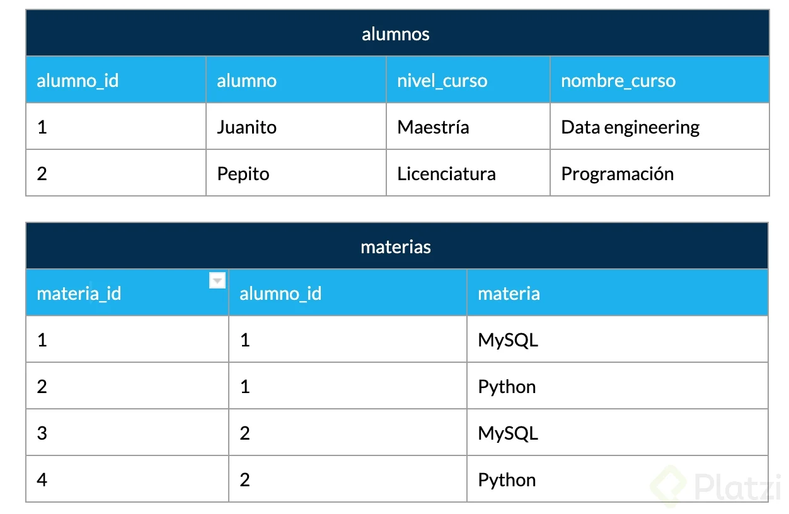

# Curso_de_Fundamentos_de_Bases_de_Datos

<h2>Content List</h2>

- [Introducción a las Bases de Datos Relacionales](#introducción-a-las-bases-de-datos-relacionales)
- [Qué son entidades y atributos](#qué-son-entidades-y-atributos)
- [Entidades de Platzi Blog](#entidades-de-platzi-blog)
- [Relaciones](#relaciones)
- [Múltiples Muchos](#múltiples-muchos)
- [Diagrama ER](#diagrama-er)
- [Diagrama físico: Tipos de Datos y Constrains](#diagrama-físico-tipos-de-datos-y-constrains)
- [Diagrama físico: Normalización](#diagrama-físico-normalización)
- [Formas Normales en Bases de Datos Relacionales](#formas-normales-en-bases-de-datos-relacionales)
- [Instalación Local de un RDBMS (Windows)](#instalación-local-de-un-rdbms-windows)
- [Qué es RDB y RDBMS?](#qué-es-rdb-y-rdbms)
- [Clientes Gráficos](#clientes-gráficos)
- [Servicios Administrados](#servicios-administrados)


## Introducción a las Bases de Datos Relacionales

Las bases de datos surgen de la necesidad de conservar la información más allá de lo que existe en la memoria RAM. 

Las bases de datos **basadas en archivos** eran datos guardados en texto plano, fáciles de guardar pero muy díficiles de consultar y por la necesidad de mejorar esto nacen las **bases de datos relacionales**. Su inventor **Edgar Codd** dejó ciertas reglas para asegurarse de que toda la filosofía de las bases de datos no se perdiera, estandarizando el proceso. 

[Codd's 12 Rules](https://www.mindmeister.com/es/1079684487/las-12-reglas-de-codd-del-modelo-relacional?fullscreen=1)

## Qué son entidades y atributos

En bases de datos, una entidad es la representación de un objeto o concepto del mundo real que se describen en una base de datos. Las entidades se describen en la estructura de la base de datos empleando un modelo de datos. 

<h3>¿Qué es Entidad?</h3>

Una **entidad** es algo similar a un objeto (programación orientada a objetos) y representa algo en el mundo real, incluso algo abstracto. tienen atributos que son las cosas que los hacen ser una entidad y por convecnión se ponen en plural. 

<h3>Ejemplo de Entidad en Bases de Datos</h3>

En la imagen se puede observar como ejemplo ue la entidad *Laptops* posee diferentes atributos como color, pantalla, año, modelo, etc.

<p align="center"></p>

*En el caso de antigüedad es un **atributo derivado** puesto que se puede inferir de acuerdo al año de salida*

<h3>¿Qué es un Atributo?</h3>

Son las características o propiedades que describen a la entidad (Se encieraa en un óvalo). Los atributos se componen de:

* Los **Atributos compuestos** son aquellos que tienen atributos ellos mismos.
* Los **Atributos llave** son aquellos que identifican a la entidad y no pueden ser repetidos. Existen:
    * Naturales: Son inherentes al objeto como el número de serie. 
    * Clave artificial: No es inherente al objeto y se asigna de manera arbitraria. 

<h3>Tipos de Entidades</h3>

* **Entidades fuertes:** Son entidades que pueden sobrevivir por sí solas. 
* **Entidades débiles:** No pueden existir sin una entidad fuerte y se representan con un cuadro con doble línea. 
    * Entidades débiles por identidad: No se difrencian entre sí más que por la clave de su entidad fuerte.
    * Entidades débiles por existencia: Se les asigna una clave propia. 

<h3>Cómo Representar las Entidades en Bases de Datos</h3>

Existen varios tipos de notaciones para los modelos entidad relacionamiento. *Chen* es uno de los más utilizados para diagramar lógicamente la base de datos.

<p align="center"></p>

## Entidades de Platzi Blog

En este caso se hará una base de datos, el cual consiste en un manejador de Blogspot

* Primer paso: Identificar las entidades.
* Segundo paso: Pensar en los atributos.

<h3>Diagrama ER: PlatziBlog</h3>

* Post
    * Título
    * Fecha de publicación 
    * Contenido
    * Estatus
    * Etiquetas (multivaluado)
    * Id Post
* Usuarios
    * Login
    * Password
    * Nickname
    * Email
    * IdUsuario
* Comentarios
    * Contenido
    * Fecha de publicación
    * IdComentario
    * IdUsuario(clave foránea)
* Categorías
    * Nombre de Categoría
    * idCategoría

## Relaciones

Las **Relaciones** nos permiten ligar o unir nuestras diferentes entidades y se representan con rombos. Por convención se definen a través de verbos. 

Las relaciones tienen una propiedad llamada **cardinalidad** y tiene que ver con números. Cuántos de un lado pertenecen a cuántos del otro lado: 

* Cardinalidad: 1 a 1: Persona _ tiene _ datos-contacto, para obtener la cardinalidad se extraen los números mayores de los dos lados. 
* Cardinalidad: 0 a 1: Paciente _ tiene _ hab-hospital, la habitación de hospital puede estar vacía. 
* Cardinalidad: 1 a N: Persona _ tiene _ automovil. Una persona puede tener muchos automóviles, pero, un automovil por cuestión de documentos, sólo puede tener un dueño.
* Cardinalidad: 0 a N

<p align="center"></p>

## Múltiples Muchos

<h3>Cardinalidad Muchos a Muchos</h3>

Alumno _ Pertenece _ Clase

## Diagrama ER

Un diagrama es como un mapa y nos yuda a entender cuáles son las entidades con las que vamos a trabajar, cuáes son sus relaciones y qué papel van a jugar en las aplicaciones de la base de datos. 

[Ejemplo de Diagramas ER Platzi Blogspot](/Diagrams/Diagrama_ER.drawio)

[Ejemplo de Diagramas ER Banda/Género](/Diagrams/DER_Example.drawio)

## Diagrama físico: Tipos de Datos y Constrains

Para llevar a la práctica un diagrama debemos ir más allá  y darle detalle con parámetros como: 

<h3>Tipos de Dato</h3>

* **Texto**: CHAR(n), VARCHAR(n), TEXT.
* **Números**: INTEGER, BIGINT SMALLINT, DECIMAL(n,s), NUMERIC(n,s)
* **Fecha/hora**: DATE, TIME, DATETIME, TIMESTAP
* **Lógicos**: BOOLEAN

<h3>Constraints(Restricciones)</h3>

* **NOT NULL**: Se asegura que la columna no tenga valores nulos 
* **UNIQUE**: Se asegura que cada valor en la columna no se repita 
* **PRIMARY KEY**: Es una combinación de NOT NULL y UNIQUE 
* **FOREIGN KEY**: Identifica de manera única una tupla en otra tabla 
* **CHECK**: Se asegura que el valor en la columna cumpla una condición dad
* **DEFAULT**: Coloca un valor por defecto cuando no hay un valor especificado. 
* **INDEX**: Se crea por columna para permitir búsquedas más rápidas. 

## Diagrama Físico: Normalización

La normalización como su nombre lo indica nos ayuda a dejar todo de una forma normal. Esto obedece a las 12 reglas de **codd** y nos permiten separar componentes en la base de datos: 

* **Primera forma normal (1FN)**: Atributos atómicos(Sin campos repetidos)
* **Segunda forma normal (2FN)**: Cumple 1FN y cada campo de la tabla debe depender de una clave única 
* **Tercera forma normal (3FN)**: Cumple 1FN y 2FN y los campos que No son clave, No deben tener dependencias
* **Cuarta forma normal (4FN)**: Cumple 1FN, 2FN, 3FN y los campos ultivaluados se identifican por una clave única

## Formas Normales en Bases de Datos Relacionales

La normalización en las bases de datos relacionales es uno de esos temas que, por un lado es sumamente importante y por el otro suane algo esotérico. Vamos a tratar de entender las formas normales (FN) de una manera simple para que puedas aplicarlas en tus proyectos profesionales. 

<h3>Primera Forma Normal (1FN)</h3>

Esta forma nos ayuda a eliminar los valores repetidos y no atómicos dentro de una base de datos. 

Formalmente, una tabla está en primera forma normal si: 

* Todos los atributos son atómicos. Un atributo es atómico si los elementos del dominio son simples e indivisibles. 
* No debe existir variación en el número de columnas. 
* Los campos no clave deben identificarse por la clave (dependencia funcional)
* Debe existir una independencia del orden no deben cambiar sus significados. 

Se traduce básicamente a que si tenemos campos compuestos como por ejemplo "nombre_completo" que en realidad contiene varios datos distintos, en este caso podría ser "nombre", "apellido_paterno","apellido_materno", etc. 

También debemos asegurarnos que las columnas son las mismas para todos los registros, que no haya registros con columnas de más o de menos.

Todos los campos que no se consideran clave deben depender de manera única por el o los campos que si son clave.

Los campos deben ser tales que si reordenamos los registros o reordenamos las columnas, cada dato no pierda el significado.

<h3>Segunda Forma Normal (2FN)</h3>

Esta FN nos ayuda a diferenciar los datos en diversas entidades.

Formalmente, una tabla está en segunda forma normal si:

* Está en 1FN
* Sí los atributos que no forman parte de ninguna clave dependen de forma completa de la clave principal. Es decir, que no existen dependencias parciales.
* Todos los atributos que no son clave principal deben depender únicamente de la clave principal.

Lo anterior quiere decir que sí tenemos datos que pertenecen a diversas entidades, cada entidad debe tener un campo clave separado. Por ejemplo:

<p align="center"></p>

En la tabla anterior tenemos por lo menos dos entidades que debemos separar para que cada uno dependa de manera única de su campo llave o ID. En este caso las entidades son alumnos por un lado y materias por el otro. En el ejemplo anterior, quedaría de la siguiente manera:

<p align="center"></p>


<h3>Tercera Forma Normal (3FN)</h3>

Esta FN nos ayuda a separar conceptualmente las entidades que no son dependientes.

Formalmente, una tabla está en tercera forma normal si:

* Se encuentra en 2FN
* No existe ninguna dependencia funcional transitiva en los atributos que no son clave

Esta FN se traduce en que aquellos datos que no pertenecen a la entidad deben tener una independencia de las demás y debe tener un campo clave propio. Continuando con el ejemplo anterior, al aplicar la 3FN separamos la tabla alumnos ya que contiene datos de los cursos en ella quedando de la siguiente manera.

<p align="center"></p>
<p align="center"></p>

<h3>Cuarta Forma Normal (4FN)</h3>

Esta FN nos trata de atomizar los datos multivaluados de manera que no tengamos datos repetidos entre rows.

Formalmente, una tabla está en cuarta forma normal si:

* Se encuentra en 3FN
* Los campos multivaluados se identifican por una clave única

Esta FN trata de eliminar registros duplicados en una entidad, es decir que cada registro tenga un contenido único y de necesitar repetir la data en los resultados se realiza a través de claves foráneas.

Aplicado al ejemplo anterior la tabla materia se independiza y se relaciona con el alumno a través de una tabla transitiva o pivote, de tal manera que si cambiamos el nombre de la materia solamente hay que cambiarla una vez y se propagara a cualquier referencia que haya de ella.

<p align="center"></p>
<p align="center"></p>

De esta manera, aunque parezca que la información se multiplicó, en realidad la descompusimos o normalizamos de manera que a un sistema le sea fácil de reconocer y mantener la consistencia de los datos.

Algunos autores precisan una 5FN que hace referencia a que después de realizar esta normalización a través de uniones (JOIN) permita regresar a la data original de la cual partió.

## Diagrama Físico: Normalizando Platziblog

El [Diagrama Físico](./Diagrams/DiagramaFisico.drawio) de Platziblog

## Instalación Local de un RDBMS (Windows)

Hay dos maneras de acceder a manejadores de bases de datos:

* Instalar en máquina local un administrador de bases relacional.
* Tener ambientes de desarrollo especiales o servicios cloud.

En este curso usaremos **MySQL** porque tiene un impacto histórico siendo muy utilizado y además es software libre y gratuito. La versión 5.6.43 es compatible con la mayoría de aplicaciones y frameworks.

* Root es el usuario principal que tendrá todos los permisos y por lo tanto en ambientes de producción **hay que tener mucho cuidado** al configurarlo.

## Qué es RDB y RDBMS? 

**RBD (Relational Database)**

**RDBMS (Relational DataBase Management System) Sistema Manejador de Bases de Datos Relacionales**

La  diferencia entre ambos es que as BBDD son un conjunto de datos pertenecientes (o al menos en teoría)  a un mismo tipo de contexto, que guarda los datos de forma persistente para un posterior uso, y el Sistema de gestión de BBDD o sistema manejador, es el que nos permite acceder a ella, es un software, herramienta que sirve de conexión entre las BBDD y el usuario (nos presenta una interfaz para poder gestionarla, manejarla).

RDBMS:

* MySQL
* PostgreSQL
* Etc

Todas toman un lenguaje base, pero cada uno lo apropia, imponiéndole diferentes reglas y características. 

## Clientes Gráficos

Se instala mysql server y mysql Workbench como cliente gráfico, para instalarlo en ubuntu es necesario seguir el siguiente tutorial: 

* [Instalación mysql Ubuntu](https://www.digitalocean.com/community/tutorials/how-to-install-mysql-on-ubuntu-20-04)

Adicional si se presenta errores al conectar el workbrench a mysql

```bash
sudo apt update
sudo apt install mysql-workbench

sudo mysql -u root -p
```
```sql
mysql> use mysql
mysql> SELECTUser, Host, pluginFROM mysql.user;
```

Se debe cambiar el plugin de auth_socket a mysql_native_password.
```sql
mysql> UPDATE user SET plugin='mysql_native_password' WHERE User='root';
mysql> FLUSH PRIVILEGES;
```

Comprobamos:
```sql
mysql> SELECT User, Host, plugin FROM mysql.user;
```

Y para finalemente instalar Workbench 

Se [descarga](https://dev.mysql.com/downloads/workbench/) el archivo y se procede a su instalación con el comando ```$ sudo dpkg -i deb...```

## Servicios Administrados 

Hoy en día muchas empresas ya no tienen instalados en sus servidores los RDBMS sino que los contratan a otras personas. Estos servicios administrados cloud te permiten concentrarte en la base de datos y no en su administración y actualización.

